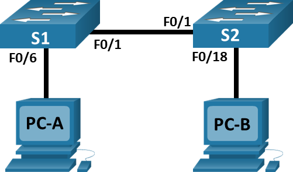
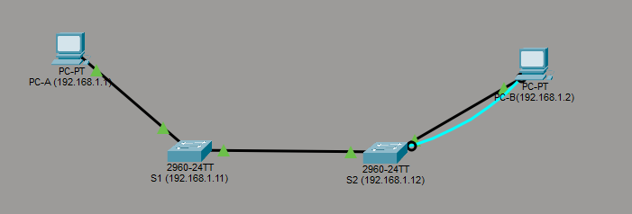
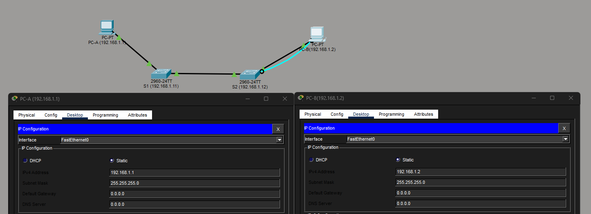

# Лабораторная работа 2. Просмотр таблицы MAC-адресов коммутатора.

## Топология.



### Таблица адресации

|  Устройство  |  Интерфейс  |  IP-адрес            | Маска подсети |
|--------------|-------------|----------------------|---------------|
|      S1      |    VLAN 1   |     192.168.1.11     | 255.255.255.0 |
|      S2      |    VLAN 1   |     192.168.1.12     | 255.255.255.0 |
|      PC-A    |    NIC      |     192.168.1.1      | 255.255.255.0 |
|      PC-B    |    NIC      |     192.168.1.2      | 255.255.255.0 |

## Цели
- Часть 1. Создание и настройка сети.
- Часть 2. Изучение таблицы MAC-адресов коммутатора.

## Часть 1. Создание и настройка сети.
1. Подключить сеть в соответствии с топологией.
2. Настройте узлы ПК.
3. Выполнить инициализацию и перезагрузку коммутаторов.
4. Настройте базовые параметры каждого коммутатора.
   - Настройте имена устройства в соответствии с топологией.
   - Настройте IP-адреса, как указано в таблице адресации.
   - Назначьте cisco в качестве паролей консоли и VTY.
   - Назначьте class в качестве пароля доступа к привилегированному режиму EXEC.
  
## Часть 2. Изучение таблицы MAC-адресов коммутатора. 
___________________________________________________________

## Часть 1.1 Подключение сети в соответствии с топологией 

   

## Часть 1.2 Настройте узлы ПК

   

## Часть 1.3
   Коммутаторы проинициализированы и перезагружены. Настроено подключение через telnet. 

## Часть 1.4 Настройте базовые параметры каждого коммутатора. 

Коммутатор 1. (Неиспользованные порты удалены в тексте для более удобного чтения).

```
C:\>telnet 192.168.1.11
Trying 192.168.1.11 ...Open


User Access Verification

Password: 
S1>
S1>
S1>show run
        ^
% Invalid input detected at '^' marker.
	
S1>enable
Password: 
S1#show run
S1#show running-config 
Building configuration...

Current configuration : 1193 bytes
!
version 15.0
no service timestamps log datetime msec
no service timestamps debug datetime msec
service password-encryption
!
hostname S1
!
enable secret 5 $1$mERr$9cTjUIEqNGurQiFU.ZeCi1
!
!
spanning-tree mode pvst
spanning-tree extend system-id
!
interface FastEthernet0/1
...
interface FastEthernet0/6
...
interface GigabitEthernet0/1
!
interface GigabitEthernet0/2
!
interface Vlan1
 ip address 192.168.1.11 255.255.255.0
!
!
line con 0
 password 7 0822455D0A16
 login
!
line vty 0 4
 password 7 0822455D0A16
 login
line vty 5 15
 login
!
!
end
```

Коммутатор 2. ((Неиспользованные порты удалены в тексте для более удобного чтения).

```
C:\>telnet 192.168.1.12
Trying 192.168.1.12 ...Open


User Access Verification

Password: 
S2>enable
Password: 
S2#show
S2#show run
S2#show running-config 
Building configuration...

Current configuration : 1241 bytes
!
version 15.0
no service timestamps log datetime msec
no service timestamps debug datetime msec
service password-encryption
!
hostname S2
!
enable secret 5 $1$mERr$9cTjUIEqNGurQiFU.ZeCi1
!
!
spanning-tree mode pvst
spanning-tree extend system-id
!
interface FastEthernet0/1
!
...
!
interface FastEthernet0/18
!
...
!
interface FastEthernet0/24
!
interface GigabitEthernet0/1
!
interface GigabitEthernet0/2
!
interface Vlan1
 ip address 192.168.1.12 255.255.255.0
!
!
line con 0
 password 7 0822455D0A16
 login
!
line vty 0 4
 password 7 0822455D0A16
 login
 transport input telnet
line vty 5 15
 login
 transport input telnet
!
!
end
```

