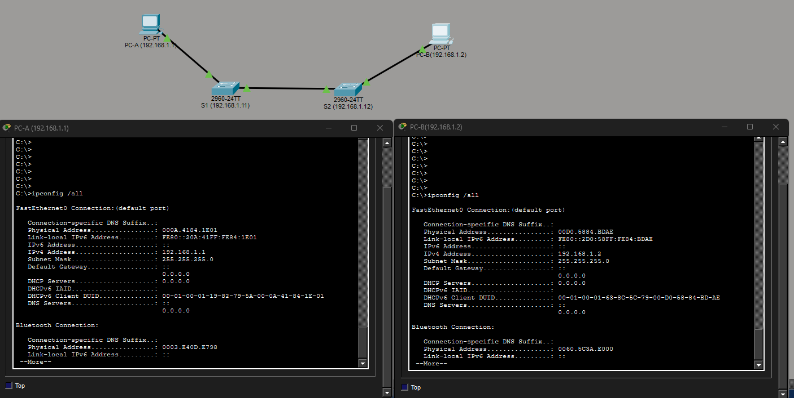
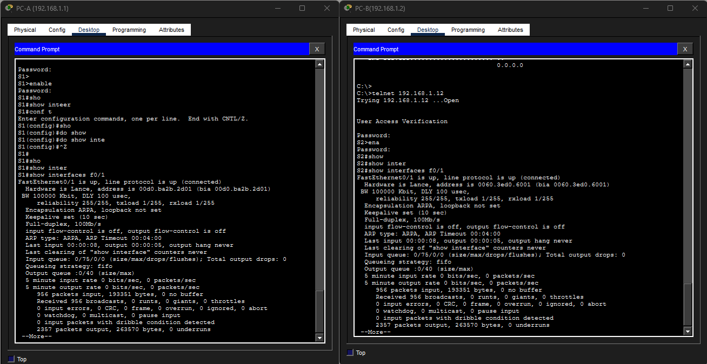

# Лабораторная работа 2. Просмотр таблицы MAC-адресов коммутатора.

## Топология.


### Таблица адресации

|  Устройство  |  Интерфейс  |  IP-адрес            | Маска подсети |
|--------------|-------------|----------------------|---------------|
|      S1      |    VLAN 1   |     192.168.1.11     | 255.255.255.0 |
|      S2      |    VLAN 1   |     192.168.1.12     | 255.255.255.0 |
|      PC-A    |    NIC      |     192.168.1.1      | 255.255.255.0 |
|      PC-B    |    NIC      |     192.168.1.2      | 255.255.255.0 |

## Цели
- Часть 1. Создание и настройка сети.
- Часть 2. Изучение таблицы MAC-адресов коммутатора.

## Часть 1. Создание и настройка сети.
1. Подключить сеть в соответствии с топологией.
2. Настройте узлы ПК.
3. Выполнить инициализацию и перезагрузку коммутаторов.
4. Настройте базовые параметры каждого коммутатора.
   - Настройте имена устройства в соответствии с топологией.
   - Настройте IP-адреса, как указано в таблице адресации.
   - Назначьте cisco в качестве паролей консоли и VTY.
   - Назначьте class в качестве пароля доступа к привилегированному режиму EXEC.
  
## Часть 2. Изучение таблицы MAC-адресов коммутатора. 
___________________________________________________________

## Часть 1.1 Подключение сети в соответствии с топологией 

   

## Часть 1.2 Настройте узлы ПК

   

## Часть 1.3
   Коммутаторы проинициализированы и перезагружены. Настроено подключение через telnet. 

## Часть 1.4 Настройте базовые параметры каждого коммутатора. 

Коммутатор 1. (Неиспользованные порты удалены в тексте для более удобного чтения).

```
C:\>telnet 192.168.1.11
Trying 192.168.1.11 ...Open


User Access Verification

Password: 
S1>
S1>
S1>show run
        ^
% Invalid input detected at '^' marker.
	
S1>enable
Password: 
S1#show run
S1#show running-config 
Building configuration...

Current configuration : 1193 bytes
!
version 15.0
no service timestamps log datetime msec
no service timestamps debug datetime msec
service password-encryption
!
hostname S1
!
enable secret 5 $1$mERr$9cTjUIEqNGurQiFU.ZeCi1
!
!
spanning-tree mode pvst
spanning-tree extend system-id
!
interface FastEthernet0/1
...
interface FastEthernet0/6
...
interface GigabitEthernet0/1
!
interface GigabitEthernet0/2
!
interface Vlan1
 ip address 192.168.1.11 255.255.255.0
!
!
line con 0
 password 7 0822455D0A16
 login
!
line vty 0 4
 password 7 0822455D0A16
 login
line vty 5 15
 login
!
!
end
```

Коммутатор 2. ((Неиспользованные порты удалены в тексте для более удобного чтения).

```
C:\>telnet 192.168.1.12
Trying 192.168.1.12 ...Open


User Access Verification

Password: 
S2>enable
Password: 
S2#show
S2#show run
S2#show running-config 
Building configuration...

Current configuration : 1241 bytes
!
version 15.0
no service timestamps log datetime msec
no service timestamps debug datetime msec
service password-encryption
!
hostname S2
!
enable secret 5 $1$mERr$9cTjUIEqNGurQiFU.ZeCi1
!
!
spanning-tree mode pvst
spanning-tree extend system-id
!
interface FastEthernet0/1
!
...
!
interface FastEthernet0/18
!
...
!
interface FastEthernet0/24
!
interface GigabitEthernet0/1
!
interface GigabitEthernet0/2
!
interface Vlan1
 ip address 192.168.1.12 255.255.255.0
!
!
line con 0
 password 7 0822455D0A16
 login
!
line vty 0 4
 password 7 0822455D0A16
 login
 transport input telnet
line vty 5 15
 login
 transport input telnet
!
!
end
```

## Часть 2. Изучение таблицы МАС-адресов коммутатора.

### Шаг 1. Запишите MAC-адреса сетевых устройств.

MAC-адреса PC-A PC-B



MAC-адреса S1 S2



### Шаг 2. Просмотрите таблицу МАС-адресов коммутатора.

Таблица MAC-адресов коммутатор S2
```
S2#show mac-ass
S2#show mac-add
S2#show mac-address-table 
          Mac Address Table
-------------------------------------------

Vlan    Mac Address       Type        Ports
----    -----------       --------    -----

   1    00d0.5884.bdae    DYNAMIC     Fa0/18
   1    00d0.ba2b.2d01    DYNAMIC     Fa0/1
S2#
```
### Шаг 3. Очистите таблицу MAC-адресов коммутатора S2 и сново отобразите таблицу MAC-адресов.

Быстрая очистка таблицы и вывод информации в консоль. Спустя 10 секунд повторный вывод таблицы MAC-адресов.

```
S2#
S2#cle
S2#clear mac
S2#clear mac add
S2#clear mac address-table dyn
S2#clear mac address-table dynamic 
S2#show mac-address-table 
          Mac Address Table
-------------------------------------------

Vlan    Mac Address       Type        Ports
----    -----------       --------    -----

   1    00d0.5884.bdae    DYNAMIC     Fa0/18
S2#show mac-address-table 
          Mac Address Table
-------------------------------------------

Vlan    Mac Address       Type        Ports
----    -----------       --------    -----

   1    00d0.5884.bdae    DYNAMIC     Fa0/18
   1    00d0.ba2b.2d01    DYNAMIC     Fa0/1
S2#
```

### Шаг 4. С компьютера PC-B отправьте эхо-запросы устройствам в сети и просмотрите таблицу МАС-адресов коммутатора.

- Выполнение команды arp -a
```
 C:\>arp -a
  Internet Address      Physical Address      Type
  192.168.1.12          000d.bd8d.a61e        dynamic
```

- Отправка эхо-запроса с PC-B на PC-A и коммутатор S1

```
C:\>ping 192.168.1.1

Pinging 192.168.1.1 with 32 bytes of data:

Reply from 192.168.1.1: bytes=32 time<1ms TTL=128
Reply from 192.168.1.1: bytes=32 time<1ms TTL=128
Reply from 192.168.1.1: bytes=32 time<1ms TTL=128
Reply from 192.168.1.1: bytes=32 time<1ms TTL=128

Ping statistics for 192.168.1.1:
    Packets: Sent = 4, Received = 4, Lost = 0 (0% loss),
Approximate round trip times in milli-seconds:
    Minimum = 0ms, Maximum = 0ms, Average = 0ms

C:\>ping 192.168.1.11

Pinging 192.168.1.11 with 32 bytes of data:

Reply from 192.168.1.11: bytes=32 time=17ms TTL=255
Reply from 192.168.1.11: bytes=32 time<1ms TTL=255
Reply from 192.168.1.11: bytes=32 time<1ms TTL=255
Reply from 192.168.1.11: bytes=32 time<1ms TTL=255

Ping statistics for 192.168.1.11:
    Packets: Sent = 4, Received = 4, Lost = 0 (0% loss),
Approximate round trip times in milli-seconds:
    Minimum = 0ms, Maximum = 17ms, Average = 4ms

C:\>
```

- Проверка MAC-адресов на коммутаторе S2 и ARP=таблица на PC-B

```
C:\>telnet 192.168.1.12
Trying 192.168.1.12 ...Open


User Access Verification

Password: 
S2>sho
S2>show mac
S2>show mac-add
S2>show mac-address-table 
          Mac Address Table
-------------------------------------------

Vlan    Mac Address       Type        Ports
----    -----------       --------    -----

   1    000a.4184.1e01    DYNAMIC     Fa0/1
   1    0040.0bbc.c7ee    DYNAMIC     Fa0/1
   1    00d0.5884.bdae    DYNAMIC     Fa0/18
   1    00d0.ba2b.2d01    DYNAMIC     Fa0/1
S2>
S2>ex

[Connection to 192.168.1.12 closed by foreign host]
C:\>arp -a
  Internet Address      Physical Address      Type
  192.168.1.1           000a.4184.1e01        dynamic
  192.168.1.11          0040.0bbc.c7ee        dynamic
  192.168.1.12          000d.bd8d.a61e        dynamic

C:\>
```

