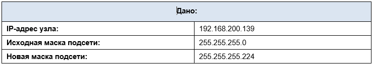

# Лабораторная работа - Расчет подсетей IPv4

### 	Задачи

- Часть 1. Определение подсетей по IPv4-адресу
- Часть 2. Расчет подсетей по IPv4-адресу

### Инструкции

Заполните приведенные ниже таблицы, зная заданный IPv4-адрес, исходную и новую маску подсети.

### Проблема 1.

Требуется найти:
  - Количество бит подсети
  - Количество созданных подсетей
  - Количество бит узлов в подсети
  - Количество узлов в подсети
  - Сетевой адрес этой подсети
  - IPv4-адрес первого узла в этой подсети
  - IPv4-адрес последнего узла в этой подсети
  - Широковещательный IPv4-адрес в этой подсети

Исходный адрес 192.168.200.139 в двоичной системе 11000000.10101000.11001000.10001011

Маска 255.255.255.0 (24) в двоичной системе 11111111.11111111.11111111 | 0000000

Новая маска 255.255.255.224 (27) в двоичной системе. 11111111.11111111.11111111.(111) | 00000

Из этого имеем. 
  - Количество бит сети k = 3;
  - Количество созданных подсетей k^3 = 8;
  - Количество бит узлов подсетей n = 5 (число знаков новой маске после символа | )
  - Количество узлов подсетей 2^n - 2 = 30 (отнимаем первый (сетевой адрес подсети) и последнний ( широковещательный адрес подсети) );

Наш IP-адрес с учетом данных в двоичном виде.

11000000.10101000.11001000.100 | 01011

Из этого следует.

